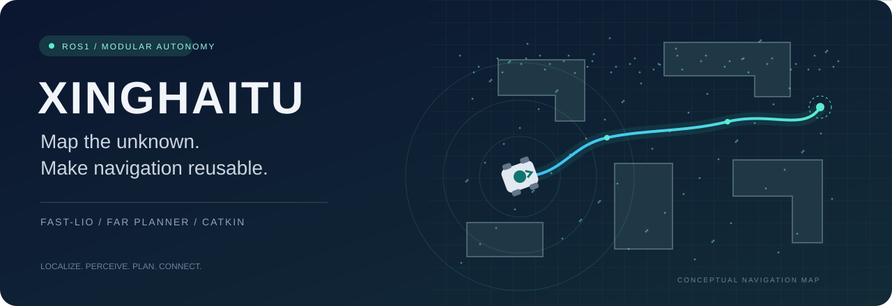
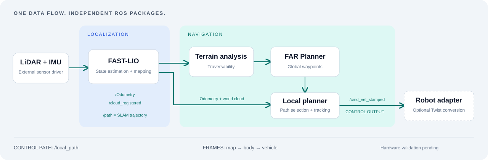

<div align="center">



# 星海图 · 自主建图与导航

**从未知环境中的第一帧点云，到可以复用的 ROS1 导航系统。**

[](https://github.com/CuiLikun/xinghaitu-slam-navigation/actions/workflows/ros1.yml)


[快速开始](#快速开始) · [安装指南](docs/installation.md) · [接入你的机器人](docs/integration.md) · [接口参考](docs/interfaces.md) · [旧版迁移](docs/migration.md)

</div>

把 **FAST-LIO 激光惯性建图、地形分析、FAR 全局规划、局部避障与四轮底盘适配** 组合为一套可拆分的 ROS1 多包仓库。可以整体放入已有 catkin 工作空间，也可以只复用导航模块并接入自己的定位系统。

> **验证边界**：项目尚未完成星海图实机与端到端导航验证。CI 检查 Noetic 编译、安装和无传感器启动；示例参数不是实机标定结果。底盘协议库、传感器时序、坐标系和路径效果仍需在目标设备上验证。

## 选择你的入口

| 你已经有…… | 从这里开始 | 需要适配的部分 |
| --- | --- | --- |
| 点云与 IMU 数据 / rosbag | [建图与回放](docs/installation.md#建图与回放) | 雷达类型、时间戳、IMU 外参 |
| 定位里程计与世界系点云 | [仅复用导航](docs/integration.md#接入已有定位系统) | 话题、`map/body/vehicle` 约定、机器人尺寸 |
| 星海图四轮底盘 | [底盘接入](docs/integration.md#星海图底盘) | 串口库、轮径轴距、速度接口 |
| 旧版仓库工作空间 | [迁移说明](docs/migration.md) | 新目录、工作空间边界、局部路径话题 |

## 一条清晰的数据链



`mapping.launch` 负责定位与建图；`navigation.launch` 组合地形分析、全局规划和局部规划。统一导航入口默认输出 `/cmd_vel_stamped`，**速度转换器需显式启用**。驱动与硬件启动由使用者组合。

## 快速开始

目标环境：**Ubuntu 20.04 + ROS Noetic + Python 3**。ROS1 Noetic 已结束官方维护，适用于仍需 ROS1 的既有系统；本仓库不声明其他发行版通过验证。

以下假设 ROS 与 rosdep 已安装。完整环境说明见[安装指南](docs/installation.md)。

```bash
source /opt/ros/noetic/setup.bash
mkdir -p ~/catkin_ws/src
cd ~/catkin_ws/src
git clone https://github.com/CuiLikun/xinghaitu-slam-navigation.git
cd ~/catkin_ws
rosdep update --include-eol-distros
rosdep install --from-paths src --ignore-src --rosdistro noetic -y
catkin_make -j2 -DLIVOX_BUILD_DRIVER=OFF -DPYTHON_EXECUTABLE=/usr/bin/python3
source devel/setup.bash
```

`LIVOX_BUILD_DRIVER=OFF` 仍生成 FAST-LIO 依赖的 Livox 消息，适用于 rosbag 或外部传感器驱动。需要随附 Livox 驱动节点时，先安装 SDK 并切换为 `ON`，见[驱动依赖](docs/installation.md#livox-驱动)。

已有 `/Odometry` 与 `/cloud_registered` 后：

```bash
roslaunch xinghaitu_bringup navigation.launch
```

在 RViz 的 **Goalpoint** 工具中设置目标。首次联调使用默认的 `0.2 m/s` 示例限速，并核实地形、坐标系和速度方向。该命令不启动底盘或传感器；没有输入数据时不会完成导航。

## 按职责组织，按 ROS 包复用

```text
xinghaitu-slam-navigation/
├── packages/
│   ├── bringup/           # xinghaitu_bringup：统一启动入口
│   ├── localization/      # fast_lio：激光惯性定位与建图
│   ├── navigation/        # 地形、全局/局部规划、边界与图消息
│   ├── visualization/     # RViz 插件与 graph_decoder
│   └── robot/             # 星海图控制、模型与仿真资源
├── third_party/
│   ├── livox_ros_driver/  # 保留上游结构和许可的 ROS1 驱动
│   └── serui/             # 厂商串口库；手动验证 ABI 后使用
├── docs/                  # 安装、接口、接入、迁移与排障
├── tools/                 # 仓库完整性与 ROS 启动检查
└── .github/workflows/     # Noetic 编译与安装验证
```

目录分组不改变 ROS 包名。catkin 会递归发现 `package.xml`；本仓库本身不再包含工作空间级 `src/CMakeLists.txt`。包清单及输入输出见[接口参考](docs/interfaces.md)。

## 文档导航

| 文档 | 内容 |
| --- | --- |
| [安装与运行](docs/installation.md) | catkin 构建、安装空间、rosbag、Livox SDK |
| [机器人接入](docs/integration.md) | 自有定位、TF、尺寸、底盘与 Gazebo |
| [接口与包清单](docs/interfaces.md) | 数据流、launch 参数、复用边界 |
| [迁移指南](docs/migration.md) | 旧路径到新路径、行为变化 |
| [排障与验证](docs/troubleshooting.md) | 常见故障、检查命令、测试覆盖 |
| [贡献指南](CONTRIBUTING.md) | 参数改动、验证和提交约定 |

## 许可与致谢

感谢 FAST-LIO、FAR Planner、地面机器人自主导航相关模块、Livox 驱动以及底盘代码的贡献者。随附许可和原有署名均予保留。

**仓库尚无统一开源许可证**；部分包声明 `BSD`，FAST-LIO 的随附 LICENSE 为 GPLv2，底盘包仍有 `TODO` 许可字段。复用与分发须分别核查具体组件，不应把整个仓库视为同一许可证。第三方补充说明见 [third_party/README.md](third_party/README.md)。
