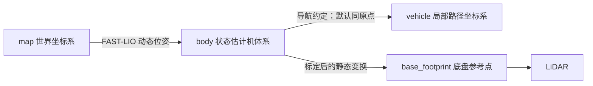

# 接入你的机器人

[返回首页](../README.md) · [接口参考](interfaces.md)

## 接入已有定位系统

可以跳过 FAST-LIO，只启动导航：

```bash
roslaunch xinghaitu_bringup navigation.launch \
  odom_topic:=/my_robot/odometry \
  cloud_topic:=/my_robot/cloud_world \
  max_speed:=0.2 autonomy_speed:=0.2 rviz:=false
```

里程计必须是 `nav_msgs/Odometry`，点云是**已经配准到世界坐标系**的 `sensor_msgs/PointCloud2`；时间戳应来自相同时间源。仅重映射名称不会转换点云坐标，也不会更改底层算法的坐标约定。

当前代码采用单机器人、`map` 世界系与 `body/vehicle` 机体系约定，部分名称在 C++ 内固定。若使用 `odom/base_link` 或多机器人命名空间，需要显式适配坐标和源码接口；统一 launch 不承诺任意 frame 自动转换。

## TF 与传感器位置



FAST-LIO 发布 `map → body`。局部规划 launch 默认提供 `body → vehicle` 零变换；已有同名 TF 时设置 `publish_body_to_vehicle_tf:=false`。每个子坐标系应只有一个父节点，每条边只保留一个发布者。

`body` 与 `vehicle` 的默认重合关系是算法使用约定，不能用随意发布 TF 的方式代替外参转换。`sensor_offset_x/y` 会进入局部规划数学计算，使用非零值时应同步检查 TF、里程计参考点和路径显示，完成回放验证。

```bash
rosrun tf tf_echo map body
rosrun tf tf_echo body vehicle
rosrun rqt_tf_tree rqt_tf_tree
```

## 尺寸与规划配置

```bash
roslaunch xinghaitu_bringup navigation.launch \
  vehicle_length:=0.85 vehicle_width:=0.60 vehicle_height:=0.75 \
  planner_config:=$HOME/robot_config/far_planner.yaml
```

这里的数值仍是示例。FAR 的 `robot_dim`、`vehicle_height` 等应在你复制的 `default.yaml` 中同步调整。局部规划参考路径的碰撞对应表按生成器 `searchRadius=0.45` 产生，修改车体尺寸并不会自动重新生成它。

更改参考路径时，使用 `local_planner/paths/path_generator.m` 同时生成三份 PLY 和 `correspondences.txt`（两个生成段默认被 `%{ … %}` 注释，需要先启用）。路径数量、分组和网格参数必须与 C++ 一致；通过 `path_folder:=/absolute/path` 使用完整的新数据集。不要混用不同生成参数下的文件。

## 星海图底盘

`smartcar_control` 的 Python 节点已通过 catkin 安装。实机节点额外依赖厂商 `serui` 原生扩展，仓库保留的 `.so` 不保证匹配当前 CPU、Python 或系统库。

先依 [串口库说明](../third_party/serui/README.md) 验证原生依赖，再启动简化底盘入口：

```bash
roslaunch smartcar_control base.launch \
  serial_dev:=/dev/ttyUSB0 publish_odom_transform:=false start_enable:=false
```

确认轮径、轮距、轴距和急停逻辑后，再按底盘实际流程启用。`base_4wheel.launch` 是历史整机示例，还依赖仓库未提供的 `lifter` 和 `xkone_xt1_driver_node`，不作为通用入口。

局部规划输出是 `geometry_msgs/TwistStamped`，底盘输入是 `geometry_msgs/Twist`。完成独立底盘联调后可启用消息转换：

```bash
roslaunch xinghaitu_bringup navigation.launch \
  enable_cmd_vel_converter:=true cmd_vel_topic:=/cmd_vel
```

转换器只转发 `twist` 字段，不做坐标变换、限速或超时停车。不同机器人应自行接入控制仲裁及看门狗；星海图节点自身提供的速度超时与急停也需要实机验证。

建议联调顺序：传感器回放 → 地形与路径观察 → 底盘独立低速测试 → 接通控制链路 → 有急停条件的低速闭环验证。项目当前没有完成最后一项。

## Gazebo

```bash
roslaunch smartcar_description smartcar_gazebo.launch
# 或传入你自己的世界文件：
roslaunch smartcar_description smartcar_gazebo.launch \
  world_name:=$HOME/worlds/my_scene.world
```

默认使用 Gazebo 的空世界，已移除作者电脑路径。模型、控制器和仿真底盘代码仍为原有示例；部分模型引用外部资源或插件，需先检查启动日志。空世界启动不等同于完整 SLAM 仿真，传感器话题和定位输入仍需按实际仿真适配。Gazebo 动态仿真不在当前 CI 覆盖范围内。
